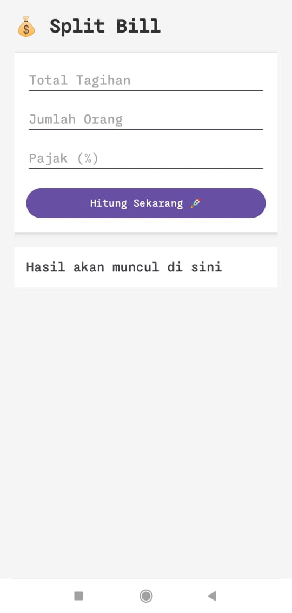
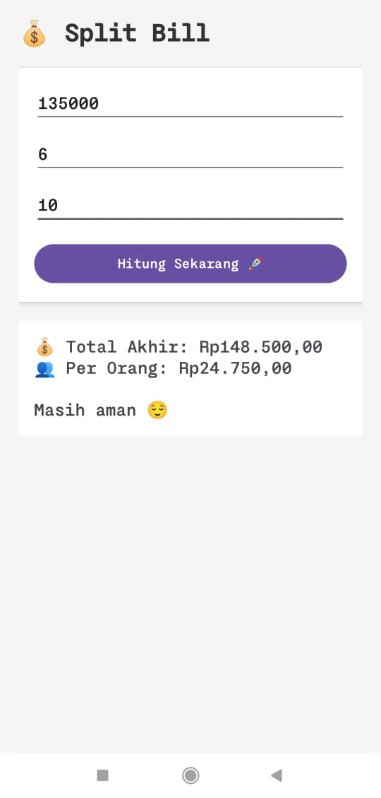

# 💰 Split Bill App

Aplikasi Android sederhana berbasis Kotlin untuk membantu pengguna membagi tagihan secara adil (patungan) dengan mudah dan cepat.

---

## 📱 Deskripsi Aplikasi

Split Bill App adalah aplikasi yang digunakan untuk menghitung jumlah pembayaran per orang dari total tagihan.  
Pengguna hanya perlu memasukkan total tagihan, jumlah orang, dan opsional pajak, lalu aplikasi akan menghitung secara otomatis.

Aplikasi ini dibuat sebagai tugas Mobile Programming dengan implementasi komponen dasar Android seperti Button, EditText, dan TextView serta event onClick.

---

## ✨ Fitur Utama

- Input total tagihan
- Input jumlah orang
- Input pajak (opsional)
- Perhitungan otomatis pembagian tagihan
- Format mata uang Rupiah (Rp)
- Validasi input (tidak boleh kosong / error)
- Pesan hasil yang interaktif

---

## 🧠 Cara Kerja

1. Masukkan total tagihan
2. Masukkan jumlah orang
3. (Opsional) Masukkan pajak
4. Klik tombol **Hitung**
5. Hasil pembagian akan ditampilkan

---

## 📸 Screenshot Aplikasi



---

## 🛠️ Teknologi yang Digunakan

- Kotlin
- Android Studio
- XML Layout

---

## 🎯 Tujuan Pengembangan

Aplikasi ini dibuat untuk:
- Memenuhi tugas mata kuliah Mobile Programming
- Memahami penggunaan komponen UI Android
- Mengimplementasikan event handling (onClick)
- Melatih logika perhitungan sederhana

---

## 🚀 Cara Menjalankan

1. Clone repository ini:
   ```bash
   git clone https://github.com/Ardihh/splitbill-calc.git
